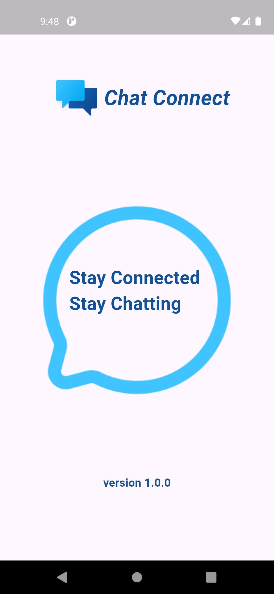
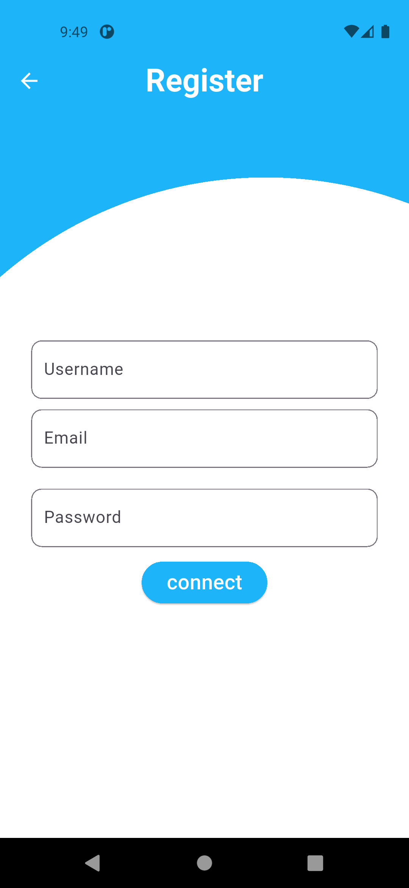
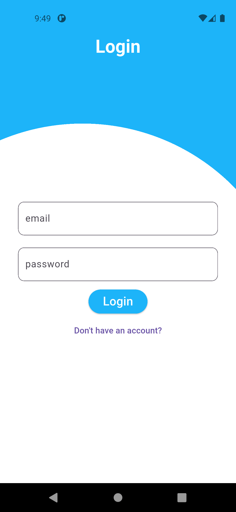
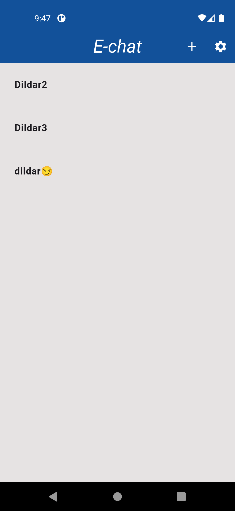
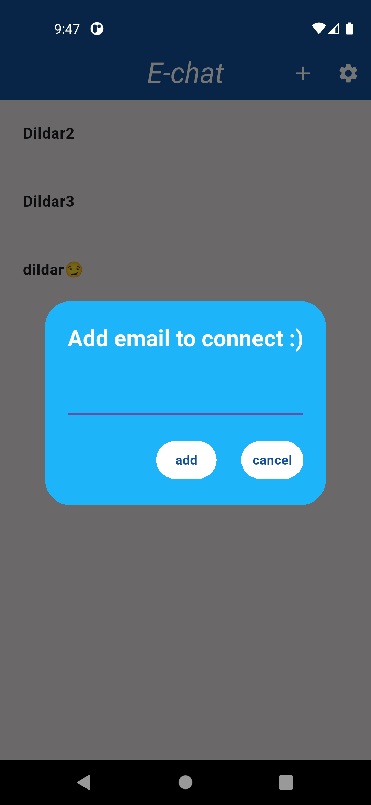
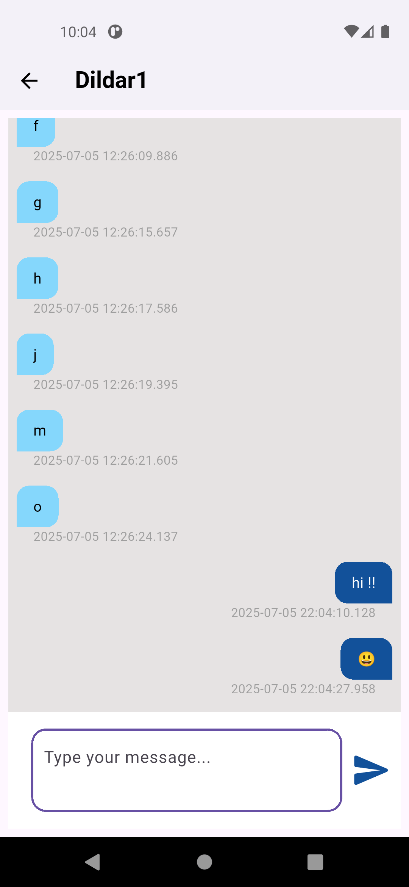

# chat_connect

A real-time flutter chat app with Firebase Firestore for one-to-one messaging & also message persistence. Integrated firebase authentication for secure user login and session management. Implemented an intuitive UI with auto-scroll, message timestamps, and responsive chat bubbles

### App Screenshot

[🔗Watch demo video](https://youtu.be/hWV5J_cAvoM)
 

Register and Login

  
  
  

 

Chat Interface

  
  
  

 

### Database (Cloud Firestore)

